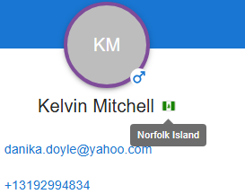

# Changeis Code Challenge - People Directory

React application for browsing and searching through a collection of people data. Built with Material UI for a professional and responsive user interface.

## 🚀 Features

- **Person Directory**: Browse through a collection of people with detailed information
- **Search Functionality**: Search by name, email, or city with real-time filtering
- **Responsive Design**: Works seamlessly on desktop, tablet, and mobile devices
- **Material UI Components**: Professional design with consistent styling
- **Gender Icons**: Visual representation of gender using Material UI icons
- **Country Flags**: Interactive country flags with tooltips using react-country-flag library
- **Contact Information**: Direct links for email and phone contacts
- **Loading States**: Smooth loading indicators and error handling
- **API Integration**: Fetches data from fakerapi.it for realistic person data

## 📸 Screenshots

### Desktop View


_Main page showing the person directory with search functionality_

### Mobile View


_Responsive design on mobile devices_

### Search Results


_No search results display_

### Interactive Features


_Country flag tooltip on hover_


_Custom styling and interactions_

## 🛠️ Tech Stack

- **Frontend Framework**: React 19.1.1
- **Build Tool**: Vite 7.1.2
- **Language**: TypeScript 5.8.3
- **UI Library**: Material UI (MUI) 5.x
- **HTTP Client**: Axios 1.12.1
- **Styling**: Material UI's sx prop and theme system
- **Icons**: Material UI Icons

## 📋 Prerequisites

Before running this project, make sure you have the following installed:

- **Node.js** (version 16 or higher)
- **npm** (comes with Node.js)

## 🚀 Installation & Setup

1. **Clone the repository**

   ```bash
   git clone <repository-url>
   cd Changeis
   ```

2. **Install dependencies**

   ```bash
   npm install
   ```

3. **Start the development server**

   ```bash
   npm run dev
   ```

4. **Open your browser**
   Navigate to `http://localhost:5173` to view the application

## 📜 Available Scripts

- `npm run dev` - Start the development server
- `npm run build` - Build the project for production
- `npm run preview` - Preview the production build locally
- `npm run lint` - Run ESLint to check for code quality issues

## 🏗️ Project Structure

```
src/
├── api/
│   └── fakerApi.ts          # API service for fetching person data
├── components/
│   ├── AppHeader/           # Application header
│   ├── ErrorAlert/          # Error message component
│   ├── LoadingSpinner/      # Loading indicator
│   ├── NoResults/           # No results display
│   ├── Person/              # Person-related components
│   │   ├── ContactInfo.tsx  # Contact details (email, phone, address)
│   │   ├── CountryFlag.tsx  # Country flag display
│   │   ├── EditMenu.tsx     # Edit/Delete menu
│   │   ├── PersonCard.tsx   # Person card component
│   │   └── PersonGrid.tsx   # Grid layout
│   ├── SearchBar/           # Search input
│   └── SearchResults/       # Search results container
├── constants/               # App configuration and messages
├── interfaces/              # TypeScript type definitions
├── pages/
│   └── Home.tsx             # Main page component
├── utils/                   # Utility functions
├── App.tsx                  # Root component
└── main.tsx                 # Application entry point
```

### Key Components

- **`Home.tsx`**: Main page with search and person grid
- **`SearchResults.tsx`**: Search results counter and status display
- **`PersonCard.tsx`**: Individual person display with avatar, contact info, and actions
- **`ContactInfo.tsx`**: Contact details using map() for email, phone, and address
- **`CountryFlag.tsx`**: Country flag display with tooltips using react-country-flag library
- **`EditMenu.tsx`**: Three-dot menu with edit/delete actions
- **`fakerApi.ts`**: API service for fetching person data

## 🎨 Design Features

- **Material Design**: Follows Google's Material Design principles
- **Responsive Grid**: Automatically adjusts from 1 to 4 columns based on screen size
- **Interactive Elements**: Hover effects, loading states, and smooth transitions

## 🔍 Search Functionality

The search feature allows users to filter people by:

- **Name** (first name or last name)
- **Email address**
- **City** (from address information)

Search is case-insensitive and updates results in real-time as you type.

## 📱 Responsive Design

The application is fully responsive with breakpoints:

- **Mobile** (< 600px): 1 column layout
- **Tablet** (600px - 960px): 2 columns
- **Desktop** (960px - 1280px): 3 columns
- **Large Desktop** (> 1280px): 4 columns

## 🚀 Deployment

To build the project for production:

```bash
npm run build
```

The built files will be in the `dist/` directory, ready for deployment to any static hosting service.

## 🙏 Acknowledgments

- [fakerapi.it](https://fakerapi.it/) for providing the person data API
- [Material UI](https://mui.com/) for the component library
- [Vite](https://vitejs.dev/) for the fast build tool
